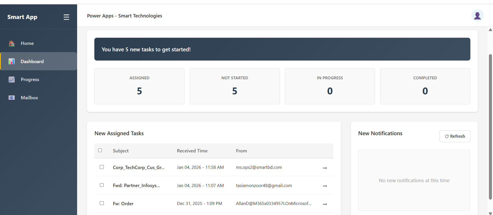

# Email Order Management - Code Apps Test Repository

This is a test repository for code apps to replicate the **Email Order Management** functionality from Power Apps low-code using **VS professional code**.



## Overview

This project demonstrates how to build professional-grade applications using modern web technologies (React, TypeScript, Vite) that replicate Power Apps low-code patterns. It serves as a proof-of-concept for transitioning from Power Apps low-code to professional code development using Visual Studio Code.

## Project Structure

- **my-sample-app/** - React + TypeScript application for email order management
- **pcf-hello/** - Power Component Framework (PCF) control for integration with Power Apps

## Technology Stack

- **Frontend:** React 18 with TypeScript
- **Build Tool:** Vite
- **Styling:** CSS
- **Package Manager:** npm
- **Code Quality:** ESLint

## Getting Started

### Prerequisites
- Node.js 16.x or 18.x
- npm or yarn

### Installation

```bash
cd my-sample-app
npm install
```

### Development

```bash
npm run dev
```

Vite will start a development server with Hot Module Replacement (HMR) for fast development feedback.

### Build

```bash
npm run build
```

Production-ready files will be generated in the `dist/` directory.

## Features

- Email order management functionality
- Low-code Power Apps patterns replicated in professional code
- Type-safe development with TypeScript
- Modern React patterns and best practices
- Fast development experience with Vite

## Purpose

This repository serves as a learning resource and template for teams looking to:
- Transition from Power Apps low-code to professional code development
- Understand modern web development practices
- Replicate Power Apps functionality in React
- Maintain code quality with type safety and linting

## Contributing

Feel free to contribute improvements, bug fixes, or enhancements to this test repository.
